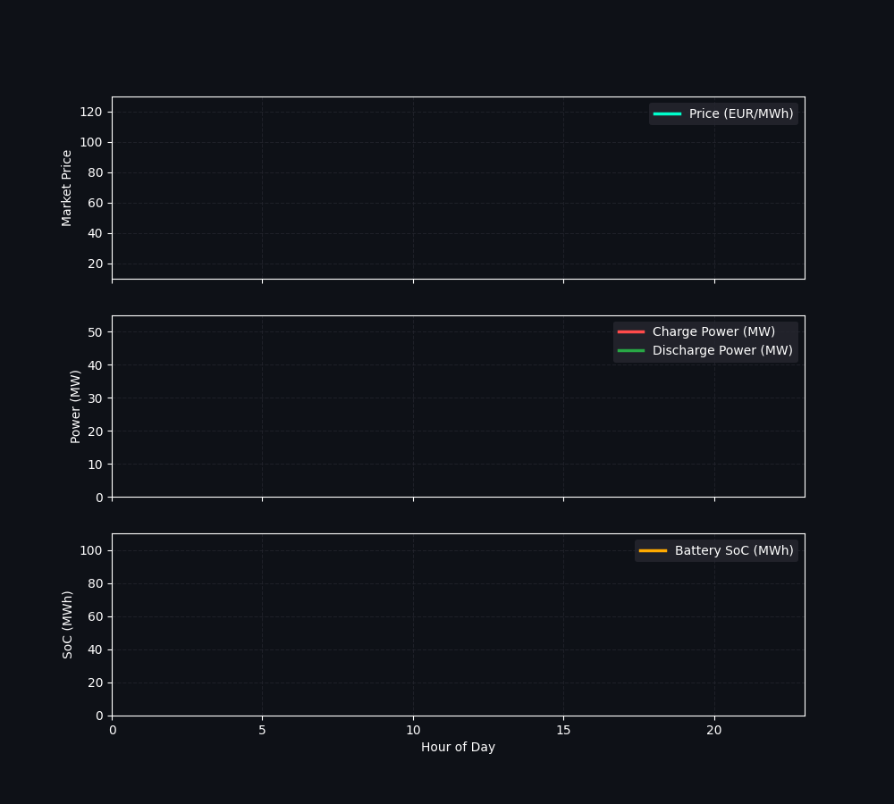

# Berlin Solar PV & BESS Optimization Pipeline

End-to-end data science and mathematical optimization platform featuring machine learning-based solar photovoltaic power generation forecasting for Berlin grids, combined with an optimal Battery Energy Storage System (BESS) market arbitrage dispatch model.

## Project Architecture
- **Solar PV Forecasting**: XGBoost regressor trained on meteorological features (solar zenith angle, wind speed, temperature) with chronological data splitting.
- **BESS Optimization**: Linear programming solver via **PuLP** utilizing real-world Day-Ahead electricity prices from the **ENTSO-E Transparency Platform**.
- **Interactive Dashboard**: Built with **Streamlit** featuring real-time data integration, mock fallbacks, and animated visualization analytics.

## Tech Stack
- **Language**: Python
- **ML / Optimization**: Scikit-Learn, XGBoost, PuLP
- **Data / APIs**: Pandas, NumPy, ENTSO-E API (`entsoe-py`)
- **Visualization**: Matplotlib (Dark Theme), Streamlit
- **CI/CD & Testing**: GitHub Actions, Pytest

## Visuals & Dashboard Preview

### BESS Market Arbitrage Dispatch
The animation below illustrates the optimization behavior of the 100 MWh battery storage system over a 24-hour cycle, contrasting fluctuating day-ahead electricity prices with real-time charging/discharging rates and state-of-charge (SoC) dynamics:



### Interactive Streamlit Dashboard
Access the live cloud interface to test custom parameters, run real-time API queries against ENTSO-E, and interact with solar forecasting components:

[](https://berlin-solar-pv-bess-optimization-9udsteuu6ixbzlkgsaastv.streamlit.app/)

## Repository Structure
```text
berlin-solar-pv-bess-optimization/
├── .github/
├── assets/
├── notebooks/
│   └── berlin_pv_forecast_bess_optimization.ipynb
├── src/
├── tests/
├── .gitignore
├── README.md
├── app.py
└── bess_optimization_animation.gif
